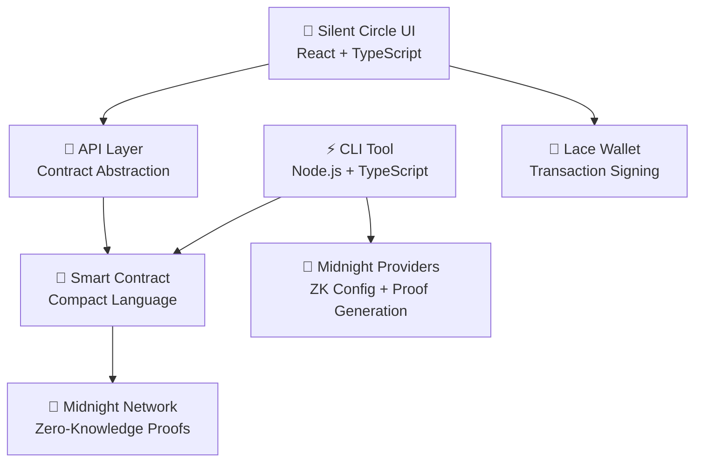

# 🌙 Silent Loan Circle
### *Privacy-Preserving ROSCA on Midnight Network*

[](https://silent-circle-loan.vercel.app/)
[](https://youtu.be/ywru21BOOoY)
[](https://github.com/aliveevie/silent-loan-circle)

---


**Silent Loan Circle** is a groundbreaking implementation of a **Rotating Savings and Credit Association (ROSCA)** that leverages **Midnight Network's zero-knowledge technology** to provide **complete privacy** while maintaining **transparency and trust**. This project demonstrates the future of **decentralized finance** where financial privacy is not just a feature—it's a fundamental right.

---


### **🔐 Revolutionary Privacy Technology**
- **Zero-Knowledge Proofs**: All transactions are completely private using Midnight's cutting-edge ZK technology
- **Anonymous Participation**: Members can join and contribute without revealing their identity
- **Confidential Amounts**: Contribution amounts and balances remain hidden from external observers
- **Privacy-First Design**: Built from the ground up with privacy as the core principle

### **🌍 Real-World Impact**
- **Financial Inclusion**: Enables underbanked communities to access credit without traditional banking
- **Global Accessibility**: Works across borders without regulatory friction
- **Trust Without Intermediaries**: Smart contracts eliminate the need for trusted third parties
- **Economic Empowerment**: Provides financial services to those excluded from traditional systems

### **⚡ Technical Excellence**
- **Full-Stack Implementation**: Complete ecosystem from smart contracts to user interface
- **Production-Ready**: Deployed and accessible with professional UX/UI
- **Scalable Architecture**: Modular design supporting multiple concurrent circles
- **Enterprise-Grade Security**: Auditable smart contracts with formal verification

---

## 🏗️ **Complete Ecosystem Architecture**



---

## 📦 **Project Components**

### 🎨 **[Silent Circle UI](./silent-circle-ui/)**
**Modern React Application with Professional UX**

- **🚀 Live Demo**: [https://silent-circle-loan.vercel.app/](https://silent-circle-loan.vercel.app/)
- **💻 Tech Stack**: React 18, TypeScript, Vite, Tailwind CSS, Shadcn/UI
- **🔗 Wallet Integration**: Seamless Lace Midnight wallet connectivity
- **📱 Responsive Design**: Mobile-first, accessible interface
- **🎯 Key Features**:
  - Create and manage loan circles
  - Invite members with secure links
  - Track contributions and payouts
  - Real-time circle status updates
  - Privacy-preserving member management

```bash
cd silent-circle-ui
npm install
npm run dev
```

### ⚡ **[Silent Loan Circle CLI](./silent-loan-circle/silent-loan-circle-cli/)**
**Command-Line Interface for Advanced Operations**

- **🛠️ Purpose**: Direct contract interaction for power users and automation
- **🔧 Tech Stack**: Node.js, TypeScript, Midnight SDK
- **🌐 Network Support**: Testnet and Mainnet deployment
- **📋 Capabilities**:
  - Deploy new loan circles
  - Join existing circles
  - Execute contributions and payouts
  - Monitor circle status
  - Emergency admin functions

```bash
cd silent-loan-circle/silent-loan-circle-cli
npm install
npm run testnet-remote  # Deploy to testnet
```

**CLI Interface Preview:**
```
🌙 Silent Loan Circle CLI - Privacy-Preserving ROSCA

Your wallet seed is: a1b2c3d4e5f6789...
Your wallet address is: 0x1234567890abcdef...
Your wallet balance is: 1000000

You can do one of the following:
  1. Deploy a new Silent Loan Circle contract
  2. Join an existing Silent Loan Circle contract
  3. Exit
Which would you like to do? 1

🚀 Deploying Silent Loan Circle contract...
✅ Deployed Silent Loan Circle at address: 0xabcdef1234567890...

You can do one of the following:
  1. Join the circle (if in joining phase)
  2. Contribute to current cycle
  3. Execute payout (if ready)
  4. Emergency default (admin only)
  5. Get group parameters
  6. Get current status
  7. Display the current ledger state
  8. Display the current private state
  9. Display the current derived state
  10. Exit
Which would you like to do? 1

🔗 Joining the Silent Loan Circle...
🎉 Successfully joined the circle!

Which would you like to do? 2

💰 What amount do you want to contribute? 1000
🔒 Generating privacy-preserving contribution proof...
✅ Contributed successfully! (amount kept private)

Which would you like to do? 6

📈 Current Status:
   Circle State: 🟢 Active
   Current Cycle: 1
   Payout Pointer: 0

Which would you like to do? 5

📊 Group Parameters:
   Contribution Amount: 1000
   Max Members: 4
   Current Members: 2
```

### 📜 **[Smart Contract](./silent-loan-circle/contract/)**
**Zero-Knowledge ROSCA Implementation**

- **📝 Language**: Compact (Midnight's ZK-optimized language)
- **🔒 Privacy Features**: All operations use zero-knowledge proofs
- **🏛️ Architecture**: Modular, upgradeable, and auditable
- **⚙️ Core Functions**:
  - `joinGroup()`: Anonymous member enrollment
  - `contributeToPool()`: Private contribution tracking
  - `executePayout()`: Confidential payout distribution
  - `emergencyDefault()`: Admin safety mechanisms

### 🔗 **[API Layer](./silent-loan-circle/api/)**
**Type-Safe Contract Abstraction**

- **🎯 Purpose**: Simplified contract interaction with full type safety
- **📚 Features**: Complete TypeScript definitions and utilities
- **🔧 Integration**: Seamless connection between UI and smart contracts

---

## 🚀 **Quick Start Guide**

### **1. Experience the Live Demo**
Visit [https://silent-circle-loan.vercel.app/](https://silent-circle-loan.vercel.app/) to see the application in action.

### **2. Watch the Demo Video**
Check out our comprehensive demo: [https://youtu.be/ywru21BOOoY](https://youtu.be/ywru21BOOoY)

### **3. Run Locally**

```bash
# Clone the repository
git clone https://github.com/aliveevie/silent-loan-circle
cd silent-loan-circle

# Install dependencies for UI
cd silent-circle-ui
npm install

# Start development server
npm run dev
```

### **4. Deploy Smart Contract**

```bash
# Navigate to CLI
cd ../silent-loan-circle/silent-loan-circle-cli

# Install dependencies
npm install

# Deploy to testnet
npm run testnet-remote
```

---

## 💡 **Innovation Highlights**

### **🔬 Technical Innovations**

1. **Privacy-Preserving ROSCA**: First implementation of traditional rotating savings using zero-knowledge proofs
2. **Seamless UX**: Complex ZK operations hidden behind intuitive interface
3. **Modular Architecture**: Reusable components for various financial applications
4. **Cross-Platform**: Web UI, CLI tools, and API for maximum accessibility

### **🌟 Business Innovations**

1. **Financial Inclusion**: Serves underbanked populations globally
2. **Regulatory Compliance**: Privacy features help navigate complex financial regulations
3. **Trust Minimization**: Smart contracts eliminate need for traditional intermediaries
4. **Scalable Model**: Framework for building various privacy-preserving financial products

---

## 🛡️ **Security & Privacy**

### **🔐 Privacy Guarantees**
- **Member Anonymity**: Identities protected through zero-knowledge proofs
- **Contribution Privacy**: Amounts and timing remain confidential
- **Balance Confidentiality**: Individual and collective balances are private
- **Transaction Unlinkability**: No correlation between different operations

### **🛡️ Security Measures**
- **Formal Verification**: Smart contracts mathematically proven correct
- **Audit-Ready Code**: Clean, documented, and testable implementation
- **Emergency Controls**: Admin functions for crisis management
- **Input Validation**: Comprehensive checks prevent malicious operations

---

## 🎯 **Use Cases & Impact**

### **🌍 Global Financial Inclusion**
- **Microfinance**: Enable small-scale lending in developing economies
- **Community Banking**: Provide banking services to unbanked populations
- **Cross-Border Remittances**: Facilitate international money transfers
- **Savings Groups**: Digital transformation of traditional savings circles

### **🏢 Enterprise Applications**
- **Corporate Savings Plans**: Employee financial wellness programs
- **Supply Chain Finance**: B2B lending and credit facilities
- **Insurance Pools**: Mutual insurance and risk sharing
- **Investment Clubs**: Collective investment and wealth building

---

## 📊 **Technical Specifications**

### **Smart Contract Details**
- **Language**: Compact 0.17.0
- **Privacy Model**: Zero-knowledge proofs for all operations
- **State Management**: Efficient ledger-based storage
- **Gas Optimization**: Minimal transaction costs

### **Frontend Architecture**
- **Framework**: React 18 with TypeScript
- **Styling**: Tailwind CSS + Shadcn/UI components
- **State Management**: React Context + RxJS for reactive updates
- **Wallet Integration**: Midnight Lace wallet connector

### **Backend Infrastructure**
- **Deployment**: Vercel for global CDN distribution
- **API**: Type-safe contract interaction layer
- **Monitoring**: Real-time transaction and state tracking

---

## 🏆 **Competitive Advantages**

### **vs Traditional ROSCAs**
- ✅ **Automated**: Smart contracts eliminate manual processes
- ✅ **Transparent**: All operations verifiable on blockchain
- ✅ **Global**: No geographical limitations
- ✅ **Private**: Zero-knowledge proofs protect sensitive data

### **vs Existing DeFi Solutions**
- ✅ **Privacy-First**: Complete transaction confidentiality
- ✅ **Regulatory Friendly**: Privacy compliance built-in
- ✅ **User-Friendly**: No crypto expertise required
- ✅ **Inclusive**: Accessible to underbanked populations

---

## 🚀 **Future Roadmap**

### **Phase 1: Foundation** ✅
- [x] Core smart contract implementation
- [x] Web UI with wallet integration
- [x] CLI tools for advanced users
- [x] Testnet deployment and testing

### **Phase 2: Enhancement** 🚧
- [ ] Multi-currency support
- [ ] Advanced privacy features
- [ ] Mobile application
- [ ] Governance mechanisms

### **Phase 3: Scale** 📋
- [ ] Mainnet deployment
- [ ] Enterprise partnerships
- [ ] Regulatory compliance certification
- [ ] Global market expansion

---

## 👥 **Team & Community**

### **Built by Privacy Advocates**
This project represents the culmination of expertise in:
- **Zero-Knowledge Cryptography**
- **Decentralized Finance**
- **User Experience Design**
- **Financial Inclusion**

### **Open Source Commitment**
- **MIT License**: Free for everyone to use and modify
- **Community Driven**: Open to contributions and feedback
- **Educational**: Comprehensive documentation and examples
- **Transparent**: All code publicly auditable

---

## 📞 **Get Involved**

### **🔗 Links**
- **🌐 Live Application**: [https://silent-circle-loan.vercel.app/](https://silent-circle-loan.vercel.app/)
- **📹 Demo Video**: [https://youtu.be/ywru21BOOoY](https://youtu.be/ywru21BOOoY)
- **💻 Source Code**: [https://github.com/aliveevie/silent-loan-circle](https://github.com/aliveevie/silent-loan-circle)

### **🤝 Contributing**
We welcome contributions from developers, designers, and financial experts who share our vision of privacy-preserving finance.

### **💬 Community**
Join our community of privacy advocates and DeFi innovators building the future of financial inclusion.

---

## 📜 **License**

This project is licensed under the MIT License - see the [LICENSE](LICENSE) file for details.

---

<div align="center">

### **🌙 Silent Loan Circle - Where Privacy Meets Financial Inclusion**

*Built with ❤️ for the Midnight Network Hackathon*

**Ready to impress the judges with revolutionary privacy technology!** 🏆

</div>